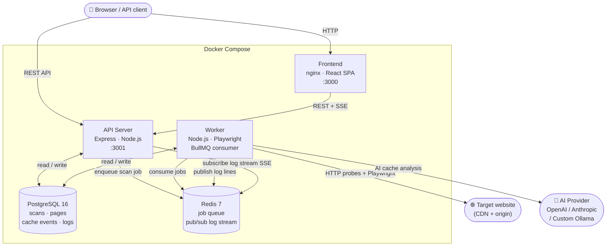

# Site Scanner and CDN performance analysis tool

<br>
<br><br>


<br><br>


<br><br>


<br><br>


<br><br>


<br><br>


<br><br>


<br><br>


<br><br><br>
> **Vibecoded** with Claude. Architected and designed by a system engineer with over a decade of hands-on CDN experience.

Most tools fire one HTTP request and read a cache header. Site Scanner takes a different approach — one built around how CDNs actually behave in production.

It starts with a **cold probe** to capture the origin baseline: HTTP status, response headers, TTFB, and full latency. It then executes a **warm loop** — firing follow-up requests until a cache HIT is confirmed or the CDN signals the content is uncacheable. Only then does it launch a **real browser** (Playwright) to measure user-facing performance on the warmed URL: LCP, FCP, CLS, TBT, TTFB, Speed Index, and a full resource waterfall.

The cold-to-warm **timing delta** is at the core of every analysis. A sharp latency or TTFB drop between probes is a reliable indicator that the CDN edge is serving from cache — even when no explicit cache header is present. This delta feeds both the built-in cache state engine and the optional AI analyser.

For DevOps and platform engineers, this translates into concrete, actionable output:

- **Cache hit ratios** broken down by scope — overall, HTML documents, and static assets — so you can see exactly where cache efficiency is being lost
- **Per-resource cache report** showing the cache state, latency, age, and size of every script, image, font, and XHR request the browser made — not just the HTML document
- **CDN detection** with confidence scoring and the specific header signals that triggered it, across Cloudflare, CloudFront, Fastly, and Akamai
- **AI cache analysis** — an LLM examines the full header set and cold-to-warm timing delta independently of vendor-specific adapters, returning a structured verdict with reasoning, an estimated hit ratio, an inferred CDN provider, and prioritised recommendations across caching, performance, security, and CDN configuration
- **Operator context** — inject site-specific knowledge directly into the AI prompt so the model can reason about your specific CDN configuration, surrogate key strategy, or known caching quirks
- **Scan-level aggregates** across hundreds of pages — LCP averages, P95, cache hit distribution, CDN spread — with cross-scan rankings to surface your worst-performing pages over time
- **Actionable recommendations** generated per page with severity levels, category, and evidence drawn from the actual response headers and timing data
- **Live scan log terminal** streaming every step of the scan in real time — probe results, AI transmissions, cache verdicts — so you can follow exactly what is happening as it happens

The result is a full-stack cache and performance audit that goes well beyond header inspection — giving you the data to confidently tune CDN configuration, identify uncacheable content, validate cache warming strategies, and quantify the real-world performance impact of caching decisions.

---

## What it does

- Scans single URLs, lists of URLs, sitemaps, or entire domains via crawling
- Detects your CDN (Cloudflare, CloudFront, Fastly, Akamai) automatically
- Measures cold vs. warmed cache states per page
- Runs a real browser (Playwright) to collect LCP, FCP, CLS, TBT, TTFB
- **Resource Cache Report** — per-resource breakdown of cache states for every script, image, font, and XHR loaded by the page (Single URL only)
- Ranks pages across scans so you can spot your worst offenders
- Exports results as CSV or JSON
- Generates actionable recommendations (critical / warning / info)
- **AI cache analysis** — optionally uses an LLM to reason about response headers and estimate the cache hit ratio independently of CDN-specific header patterns; includes per-page AI recommendations across performance, caching, security, and CDN categories
- **Scan log terminal** — live-streaming terminal panel on the scan dashboard showing every step of the scan in real time

---

## Architecture

### Infrastructure topology



### Scan pipeline

```mermaid
flowchart LR
    A([URL input]) --> B

    subgraph B ["① Cold probe"]
        B1["HTTP GET\n— headers\n— status\n— latency / TTFB"]
    end

    B --> C

    subgraph C ["② CDN detection"]
        C1["Header adapters\nCloudflare · CloudFront\nFastly · Akamai\n+ generic heuristics"]
    end

    C --> D

    subgraph D ["③ Warm loop"]
        D1["Repeat GET until\nHIT observed or\nuncacheable signal\n(configurable attempts)"]
    end

    D --> E

    subgraph E ["④ Cache normalisation"]
        E1["Compute cold→warm\ntiming delta\nNormalise cache state\nCalculate hit ratio"]
    end

    E --> F

    subgraph F ["⑤ Browser pass"]
        F1["Playwright · Chromium\nLCP · FCP · CLS · TBT\nTTFB · Speed Index\nResource waterfall"]
    end

    F --> G

    subgraph G ["⑥ Recommendations"]
        G1["Rule-based engine\ncritical / warning / info\nacross cache · perf · CDN"]
    end

    G --> H

    subgraph H ["⑦ AI analysis"]
        H1["Full header set\n+ cold→warm delta\n+ warm event log\n→ verdict · hit ratio\n· CDN inference\n· recommendations"]
    end

    H --> I([Results stored\nin PostgreSQL])

    style A fill:#e0f2fe,stroke:#0284c7
    style I fill:#dcfce7,stroke:#16a34a
```



---

## Quick start

You need **Docker** and **Docker Compose**.

```bash
git clone https://github.com/nospoe/Cache-ratio-scanner.git 
cd site-scanner
cp .env.example .env      # tweak if needed, defaults work out of the box
docker compose up
```

Open **http://localhost:3000** and start scanning.

| Service | URL |
|---|---|
| Frontend | http://localhost:3000 |
| API | http://localhost:3001 |

To stop:

```bash
docker compose down
```

---

## Scan modes

| Mode | When to use |
|---|---|
| **Single URL** | Deep dive into one page |
| **URL List** | Paste a custom list of URLs |
| **Sitemap** | Auto-discover pages from `sitemap.xml` |
| **Crawl** | Follow links from a root URL up to a configurable depth |

---

## What you can configure per scan

| Setting | Default | Notes |
|---|---|---|
| Device profile | Desktop | Desktop, Mobile (iPhone), or Custom viewport |
| Max pages | 100 | Up to 500 |
| Concurrency | 3 | Parallel pages (1–10) |
| Max crawl depth | 3 | How deep to follow links |
| Warm attempts | 5 | Requests to fire per page to warm the cache |
| Warm delay | 500ms | Delay between warm requests |
| Same origin only | On | Ignore external links during crawl |
| Respect robots.txt | On | Honor crawl rules |
| Include / exclude | — | Regex patterns to filter URLs |
| Custom headers | — | Auth tokens, cookies, etc. |
| Basic auth | — | Username + password |
| Performance scan | On | Collect browser metrics |
| Cache scan | On | Collect cache probe data |
| AI cache analysis | Off | Use an LLM to reason about headers and estimate cache hit ratio |
| AI provider | Custom | **Custom** (Ollama / any OpenAI-compatible server), **OpenAI** (direct ChatGPT), or **Anthropic** (Claude models) |
| AI model | — | Fetched live from the selected provider; falls back to a default list if unreachable |
| AI extra prompt | — | Optional free-text appended to every AI request — use it to give the model site-specific context (e.g. CDN config, known quirks) |
| Resource cache report | Off | Per-resource cache breakdown for all sub-resources (Single URL only) |
| Debug headers | Off | Inject CDN diagnostic request headers (Single URL only) — surfaces hidden cache metadata in response headers |

---

## Pages and features

### Scan list
All your past and running scans with status and quick stats.

### Scan dashboard
Aggregate view of a completed scan:
- Page counts (completed, failed, challenged)
- LCP averages (avg, median, P95)
- Overall / document / static asset cache hit ratios
- CDN distribution across all pages
- **AI cache analysis summary** (when enabled): pages analysed, AI-judged cached count, average AI-estimated hit ratio, average confidence
- **Scan log terminal** — collapsible dark terminal panel showing a live stream of every scan step (URL probed, AI transmissions, completions, errors) in real time during the scan and historically after it completes

### Page table
Every scanned page in a sortable, filterable table. Filter by CDN provider, cache state, or search by URL. Sort by LCP, TTFB, size, request count, or cache hit ratio.

### Page rankings (per scan)
Top 10 best and worst pages for LCP, TTFB, or cache hit ratio — useful for quickly spotting outliers.

### Page detail
The full breakdown for a single page:
- Performance metrics: LCP, FCP, CLS, TBT, Speed Index, TTFB, performance score
- Resource breakdown by type (JS, CSS, images, fonts)
- Render-blocking resources
- CDN detection signals and confidence score
- Cache state timeline (every probe request with its cache state, age header, and latency)
- Response headers for cold and warm probes (tabbed view)
- Warm outcome: what happened after the cache warming cycle
- AI cache analysis (when enabled): LLM reasoning, estimated hit ratio, confidence score, AI-inferred CDN provider, and AI-generated recommendations across performance / caching / security / CDN categories
- **Resource Cache Report** (Single URL + resource report enabled): every sub-resource the browser loaded, grouped by type, with cache state, HTTP status, latency, age, and size
- Actionable recommendations with severity and evidence

### Global rankings
Cross-scan comparison. See which pages and scans perform best and worst for LCP, TTFB, or cache hit ratio — across your entire history. Cache hit ratio ranks by scan aggregate (not per-page).

---

## Cache states explained

| State | Meaning |
|---|---|
| `HIT` | Served from CDN cache |
| `MISS` | Served from origin |
| `BYPASS` | CDN is configured to skip cache for this URL |
| `EXPIRED` | Cached copy existed but was too old |
| `REVALIDATED` | Conditional request confirmed the cache was still fresh |
| `STALE` | Served stale via stale-while-revalidate |
| `DYNAMIC` | Response is explicitly non-cacheable |
| `CHALLENGE` | CDN presented a bot challenge (Cloudflare "Just a moment", etc.) |
| `UNKNOWN` | Couldn't determine cache state |

### Warm outcomes

| Outcome | Meaning |
|---|---|
| `warmed-hit` | Cache HIT was observed after warming |
| `remained-miss` | Stayed MISS after all warm attempts |
| `bypass` | CDN bypasses cache — warming has no effect |
| `uncacheable` | `Cache-Control: no-store` or `private` prevents caching |
| `challenged` | Bot challenge encountered during warming |
| `error-response` | Server returned 5xx during warming |

---

## AI Cache Analysis

AI cache analysis is an **optional, per-scan feature** that feeds each page's full probe dataset to an LLM and asks it to reason independently about cache behaviour. The result is a second opinion that sits alongside — and can corroborate or contradict — the built-in CDN adapter verdict.

### Why it exists

The conventional cache analysis relies on vendor-specific header adapters (Cloudflare, CloudFront, Fastly, Akamai). If a site sits behind a custom proxy, an obscure CDN, or deliberately strips its cache headers, those adapters return `UNKNOWN`. The AI analyser has no such blind spots: it reads the full header set, applies broad HTTP caching knowledge, and crucially, **reasons about the measured performance delta between cold and warm probes** — a signal that header-only tools cannot exploit.

A dramatic latency or TTFB drop from the cold probe to the warmed probe is a strong indicator that the CDN edge is serving subsequent requests from cache, even when no `X-Cache: HIT` header is present. The model weighs this alongside the headers to reach a more holistic verdict.

### What the model reasons about

**Header signals:**
- `Cache-Control` — `max-age`, `s-maxage`, `no-cache`, `no-store`, `public`, `private`, `stale-while-revalidate`
- `Age` — seconds the object has been cached; any value > 0 is a strong HIT indicator
- `CF-Cache-Status`, `X-Cache`, `X-Cache-Status` — CDN-specific cache state headers
- `Vary` — cache key dimensions; misuse can fragment the cache and destroy hit rates
- `Set-Cookie` — presence on cacheable content is a common cause of cache bypass
- `Via`, `X-Served-By` — proxy and CDN routing signals
- `ETag`, `Last-Modified` — validators that indicate the resource is cacheable
- `Pragma`, `Expires` — legacy cache control
- `Surrogate-Control`, `Surrogate-Key` — CDN override and tag-based purge headers
- `Strict-Transport-Security`, `X-Content-Type-Options`, `X-Frame-Options`, `Content-Security-Policy` — security header presence
- Akamai-specific: `X-Akamai-Request-Id`, `X-Check-Cacheable`, `X-Cache-Key`, `X-True-Cache-Key`, server signatures

**Timing signals (the warm vs. cold delta):**
- Latency reduction from cold → warm probe — a >50% drop is a strong edge-caching signal
- TTFB on warm probes — CDN HITs typically show TTFB < 20 ms and latency < 50 ms
- Flat latency across all warm attempts — indicates the CDN is not caching the resource
- Absence of `Age` header despite low warm latency — characteristic of CDN configs that omit Age emission (common in some Akamai setups)
- Full warm event timeline — every probe request with its cache state, latency, and HTTP status

### Providers

Three providers are supported:

| Provider | How it connects | When to use |
|---|---|---|
| **Custom** | `AI_API_BASE_URL` + optional `OPENAI_API_KEY` | Self-hosted Ollama, LiteLLM, or any OpenAI-compatible server |
| **OpenAI** | `api.openai.com` + `OPENAI_API_KEY` | Direct ChatGPT — GPT-4o, GPT-4o mini, GPT-5, etc. |
| **Anthropic** | `api.anthropic.com` + `ANTHROPIC_API_KEY` | Claude models — claude-opus-4-5, claude-sonnet-4-5, claude-haiku-4-5, etc. |

Anthropic uses the native Messages API (`/v1/messages`) with `x-api-key` authentication — not the OpenAI-compatible format. No additional configuration beyond `ANTHROPIC_API_KEY` is needed.

Models are fetched live from the provider's `/models` endpoint at scan-creation time. If the provider is unreachable a fallback list is shown and you can still proceed.

### How it works

AI analysis runs as **Phase 6** of the scan pipeline, after all HTTP probes and cache warming are complete:

```
Cold probe → Warm loop → CDN detection → Cache normalisation → Browser metrics → Recommendations → AI analysis
```

For each page the worker sends to the model:
- **Cold probe** — HTTP status, full response headers, total latency, TTFB
- **Warmed probe** — HTTP status, full response headers, total latency, TTFB (if available)
- **Full warm event log** — every warming request with its request number, phase, cache state, HTTP status, and latency
- **Operator extra prompt** (if set) — site-specific context appended to every request

The model performs step-by-step reasoning over all of the above before committing to a structured JSON verdict.

### Output per page

| Field | Type | Description |
|---|---|---|
| `cached` | boolean | Whether the response was judged to be served from CDN cache on warm requests |
| `reasoning` | string | Step-by-step explanation referencing specific headers and the cold→warm timing delta |
| `cache_hit_ratio` | float 0–1 | Estimated proportion of requests that would be cache hits |
| `confidence` | float 0–1 | Model's self-assessed confidence in the verdict |
| `inferred_cdn` | string \| null | CDN provider identified from headers (e.g. `"Akamai"`, `"Cloudflare"`) |
| `operator_ack` | string \| null | One-sentence confirmation that the model understood and applied the extra prompt (null if none was set) |
| `recommendations` | array | 1–5 actionable improvement suggestions, each with `category` (performance / caching / security / cdn), `priority` (high / medium / low), `title`, and `description` — only included when directly supported by the observed evidence |
| `model` | string | The model that produced this result |

Stored as `ai_cache_analysis` JSONB on the `page_results` table. Visible in the **Page Detail** view.

### Aggregate at scan level

When AI analysis was enabled the **Scan Dashboard** shows a summary card with:
- Pages successfully analysed vs. total scanned
- Count of pages the AI judged as cached
- Average AI-estimated cache hit ratio across all pages
- Average confidence (colour-coded: green ≥70%, yellow ≥40%, red <40%)

### Enabling AI analysis

1. Tick **AI cache analysis** in the New Scan form
2. Select **Custom**, **OpenAI**, or **Anthropic** as the provider
3. Select a model from the dropdown (loaded live from the provider)
4. Optionally enter an **extra prompt** — free text appended to every AI request to give the model site-specific context (e.g. CDN configuration details, known caching quirks, or specific areas to focus on). The model acknowledges receipt of the extra prompt in the `operator_ack` field of its response.
5. Set the relevant environment variables in `.env` (see below)

**Failures are non-fatal.** Network errors, HTTP errors, timeouts, and JSON parse failures are logged and skipped — the scan continues and the AI result for that page is simply absent. Set `LOG_LEVEL=debug` to see the full request payload and raw model response in worker logs.

---

## Debug Headers

Debug headers is an **optional, Single URL only** feature that injects diagnostic request headers into every probe — both HTTP requests and the Playwright browser pass. CDNs that support these headers echo back additional cache metadata in their responses, making it possible to see cache keys, TTLs, and cacheability verdicts that are normally invisible.

### Available presets

#### Akamai — Pragma directives

Akamai reads specific values from the `Pragma` request header and echoes diagnostic data back in the response. Multiple directives are comma-joined into a single `Pragma` header.

| Directive | Response header returned |
|---|---|
| `akamai-x-cache-on` | `X-Cache` — cache state (TCP_HIT, TCP_MISS, etc.) |
| `akamai-x-get-cache-key` | `X-Cache-Key` — the cache key used for this object |
| `akamai-x-get-true-cache-key` | `X-True-Cache-Key` — the cache key after Vary stripping |
| `akamai-x-check-cacheable` | `X-Check-Cacheable` — whether the object is cacheable (`yes`/`no`) |
| `akamai-x-get-request-id` | `X-Akamai-Request-Id` — unique request identifier for log correlation |

#### Fastly

| Header sent | Response headers returned |
|---|---|
| `Fastly-Debug: 1` | `Fastly-Debug-TTL`, `Fastly-Debug-State`, `Fastly-Debug-Digest` |

### How it works

When debug headers are enabled, the selected headers are sent on:
- The cold probe HTTP request
- Every warm-up HTTP request
- The Playwright browser navigation (injected via `page.setExtraHTTPHeaders()`, so they also apply to all sub-resource fetches)

The response headers returned by the CDN appear in the **Response Headers** card (cold and warm tabs) on the Page Detail view.

> **Note:** These headers only have effect if the target site is actually served by the respective CDN and the CDN is configured to honour debug pragma requests. They are harmless on other CDNs or origins.

---

## Exports

From any scan dashboard you can export:
- **CSV** — all page metrics in spreadsheet format
- **JSON** — full data including cache events and recommendations

---

## Environment variables

Copy `.env.example` to `.env`. The defaults work for local use.

| Variable | Default | Description |
|---|---|---|
| `POSTGRES_PASSWORD` | `scannerpassword` | Database password |
| `VITE_API_URL` | *(empty)* | Override API URL for the frontend |
| `LOG_LEVEL` | `info` | `debug`, `info`, `warn`, `error` |
| `SSRF_PROTECTION` | `true` | Block scans of private/internal IPs. Set `false` for isolated networks |
| `CORS_ORIGIN` | `*` | Allowed CORS origin |
| `MAX_SCAN_URLS` | `500` | Hard cap on URLs per scan |
| `WORKER_CONCURRENCY` | `3` | Parallel pages per worker process |
| `BROWSER_TIMEOUT_MS` | `30000` | Playwright page timeout |
| `PROBE_TIMEOUT_MS` | `15000` | HTTP probe timeout |
| `MAX_WARM_ATTEMPTS` | `5` | Max warm requests per page |
| `WARM_DELAY_MS` | `500` | Delay between warm requests |
| `AI_API_BASE_URL` | `http://localhost:11434/v1` | Base URL for the **custom** provider (Ollama / OpenAI-compatible server). Ignored when using OpenAI or Anthropic providers. |
| `OPENAI_API_KEY` | *(empty)* | API key for **OpenAI** and **Custom** providers. For OpenAI: authenticates against `api.openai.com`. For custom: sent as `Authorization: Bearer` — leave empty if not required. |
| `ANTHROPIC_API_KEY` | *(empty)* | API key for the **Anthropic** provider. Sent as `x-api-key` header to `api.anthropic.com`. |

---

## Local development (without Docker)

```bash
# Backend (terminal 1 — API server)
cd backend
npm install
npm run dev

# Backend (terminal 2 — scan worker)
cd backend
npm run dev:worker

# Frontend (terminal 3)
cd frontend
npm install
npm run dev
```

Requires Node.js 22+ and a running PostgreSQL + Redis instance (or just use `docker compose up postgres redis`).

---

## Stack

| Layer | Tech |
|---|---|
| Frontend | React 18, Vite, TanStack Query, Recharts, Tailwind CSS |
| Backend | Node.js 22, Express, TypeScript |
| Database | PostgreSQL 16 |
| Queue | BullMQ on Redis 7 |
| Browser automation | Playwright |
| Containers | Docker Compose |

---

## How the cache warming works

1. **Cold probe** — one HTTP GET, no prior requests, records cache state and headers
2. **Warm loop** — up to N follow-up requests (configurable), with a configurable delay between each; stops as soon as a `HIT` is observed or the CDN signals bypass/uncacheable
3. **Browser pass** — Playwright loads the page after warming so performance metrics reflect the cached experience
4. **Cache hit ratio** — calculated from the warm probes only (cold probe is excluded since it's always a MISS for uncached pages)

CDN detection happens automatically from response headers. Vendor-specific adapters handle Cloudflare, CloudFront, Fastly, and Akamai. Everything else falls back to generic heuristics (`Via`, `Age`, `X-Cache`).
